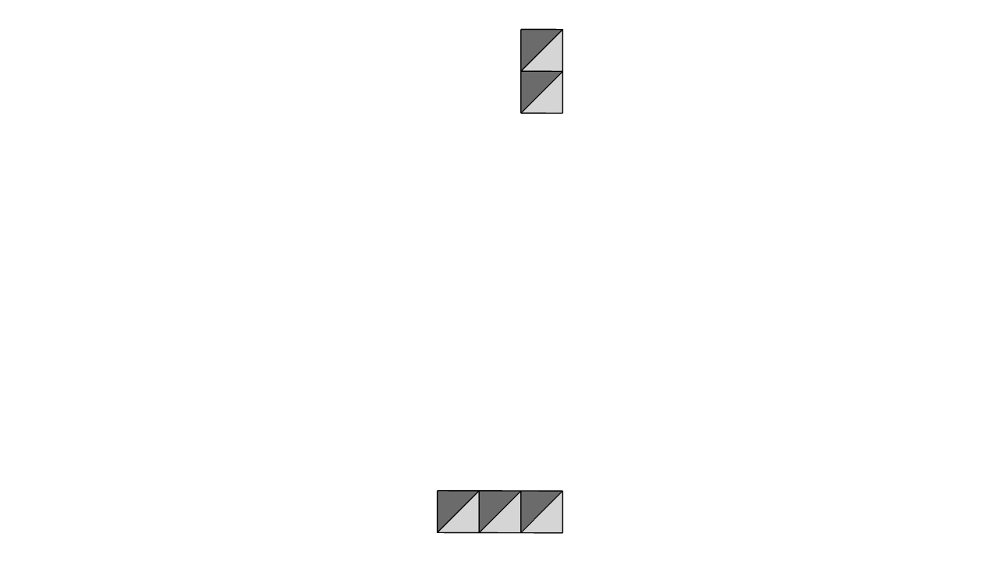
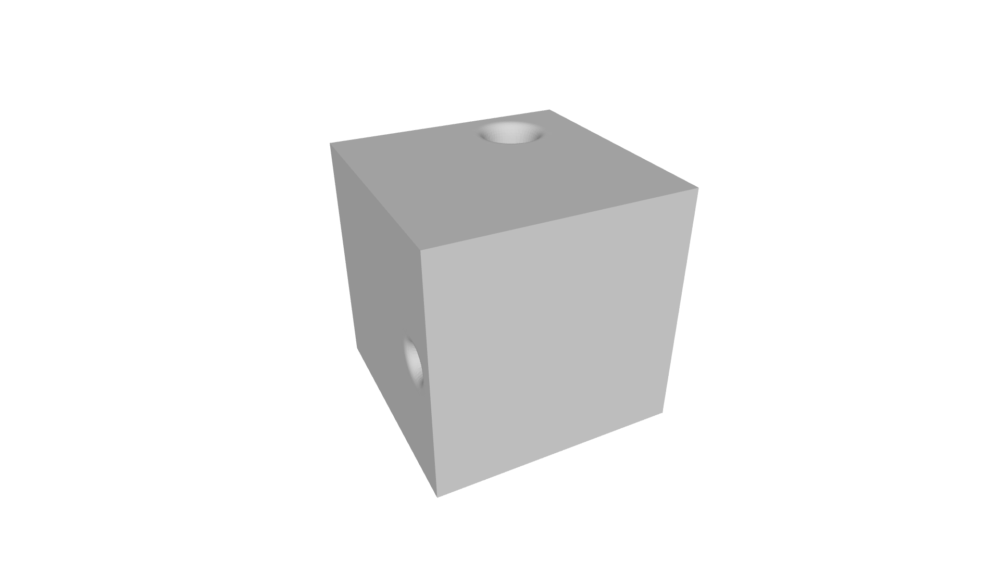
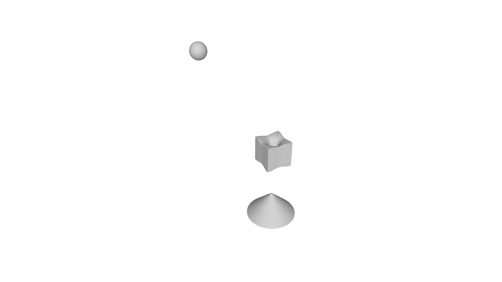

# Problem 1 — Triangle mesh (STL, reorientation, void detection)

## Overall Thoughts

This problem involves loading a triangle mesh from an ASCII STL file, building edge‑to‑triangle connectivity, reorienting triangles to ensure consistent winding across the mesh, and detecting closed voids (e.g., inner shells) so they can be exported back to ASCII STL. At its core, the solution relies on graph‑style traversal (BFS over triangles and edges) combined with simple geometric checks such as axis‑aligned bounding boxes (AABBs) and containment tests.

This was the second problem I solved for the exam. While the domain was new to me, I thoroughly enjoyed working through it. Problems 1 and 2 complement my personal project on toolpath generation for a [simple slicing library](https://github.com/faisal-bhuiyan/simple-slice) particularly well. I spent upwards of ten hours crafting a solution that emphasizes clear structure, readable code, thorough testing, and production-readiness rather than aiming for a minimal/Leetcode style implementation.

## Approach

*Prompt: High-level plan, assumptions, algorithmic choices, and complexity trade-offs.*

- **High-level plan:**
  - **Triangle mesh & STL I/O:** A `TriangleMesh` class loads from an ASCII STL path, parses triangles via `parse_ascii_stl`, validates (non-empty, no degenerate triangles, manifold edges), and builds edge-to-triangle connectivity in the constructor. Edges are stored in canonical form (lexicographically ordered endpoints) so adjacency is unique and consistent.

  - **Reorientation:** Standalone functions in `reorient_triangles.hpp` / `.cpp` implement `flip_triangle`, `has_directed_edge`, `are_orientations_consistent`, and `reorient_inconsistent_triangles`. Starting from a seed triangle, BFS propagates orientation; neighbors that traverse the shared edge in the same direction are flipped. Only the connected component containing the seed is processed. `export_inconsistent_triangles` reorients and writes the affected triangles to an output stream in ASCII STL format.

  - **Void detection:** `find_connected_components` uses BFS over the mesh to partition triangles into connected components. A component is closed if every edge is shared by exactly two triangles. Among closed components, a component is a void if its axis-aligned bounding box (AABB) is contained in the AABB of some other closed component. `identify_voids` implements this; `export_voids_to_stl` finds components, filters closed ones, identifies voids, and writes their triangles to an output stream in ASCII STL format.

- **Input formats:**
  - **Triangle mesh:** Path to an ASCII STL file. The STL parser groups every three `vertex` lines into a triangle; other keywords are ignored. Binary STL is supported only via `convert_binary_stl_to_ascii`, which converts to ASCII for use with `TriangleMesh`.

- **Assumptions:**
  - The mesh is manifold: each edge is shared by at most two triangles. Non-manifold edges cause the constructor to throw.
  - No degenerate triangles: no duplicate vertices and no zero area (co-linear vertices). Degenerate triangles cause the constructor to throw.
  - Void detection is based on AABB containment only; no point-in-mesh or winding-number tests. A closed component whose AABB lies inside another's is classified as a void.

- **Algorithmic choices:**
  - **Canonical edges:** `make_edge` orders endpoints lexicographically (x, then y, then z) so the same geometric edge always maps to one key in the connectivity map.
  - **Reorientation:** BFS from the seed; for each edge shared with an unvisited neighbor, check orientation via `are_orientations_consistent` (shared edge must be traversed in opposite direction); if inconsistent, flip the neighbor (swap second and third vertices) and record it.
  - **Connected components:** BFS over triangles using edge connectivity; each triangle is in exactly one component.
  - **Closed component:** For every triangle in the component, every edge has exactly two incident triangles (no boundary edges).
  - **Voids:** For each closed component, compute AABB (with optional padding). A component is a void if its AABB is contained (with tolerance) in the AABB of at least one other closed component.

- **Complexity / trade-offs:**
  - Parsing and connectivity: $O(\text{triangles})$ for parsing; $O(\text{triangles})$ for building edge connectivity (three edges per triangle, hash map).
  - Reorientation: $O(\text{triangles in seed's component})$ for one BFS.
  - Void detection: $O(\text{triangles})$ for connected components and closed check; $O(\text{components}^2)$ for void identification via pairwise AABB containment. Validation (degenerate, non-manifold) is done up front to keep the rest of the pipeline on valid data.

## Work / Derivation

*Prompt: Key derivations, proofs, or notes showing how you arrived at formulas or algorithms.*

Please see the attached handwritten notes for further design details.

- **Canonical edge and connectivity:**
  An edge is represented as a pair of points with the lexicographically smaller point first. This gives a unique key per geometric edge regardless of triangle vertex order and allows a single map from edge to (at most) two triangle indices. Boundary edges store `kBoundaryTriangleIndex` in the second slot; a third triangle sharing the same edge triggers the non-manifold check and an exception.

- **Reorientation invariants:**
  Two triangles sharing an edge are consistently oriented if they traverse that edge in opposite directions (one has the edge a→b, the other b→a). `has_directed_edge` checks for a directed edge in the triangle; `are_orientations_consistent` requires exactly one of the two triangles to have the edge in the canonical direction. Flipping is done by swapping the second and third vertices so the directed edge reverses.

- **Reorient_inconsistent_triangles:**
  BFS from the seed over the mesh using edge connectivity. For each current triangle and each shared edge, the neighbor is visited; if the neighbor's orientation is inconsistent with the current triangle, the neighbor is flipped (in a copy that is recorded; the mesh is not updated in the current implementation). Only the connected component containing the seed is traversed.

- **Find_connected_components and closed check:**
  Repeatedly choose the smallest unvisited triangle index as a seed, run BFS via edge connectivity (following edges that have two incident triangles), and collect the component. A component is closed iff for every triangle in it, every edge has both connectivity slots not equal to `kBoundaryTriangleIndex`.

- **Identify_voids:**
  With at least two closed components, compute an AABB per component (e.g. via `compute_component_aabb` with optional padding). A component is a void if its AABB is contained in the AABB of at least one other closed component, using `aabb_contains` with a tolerance.

## Tests / Results

*Prompt: Short description of tests you ran, inputs used, and important outputs or timings.*

An extensive test suite was developed to provide broad coverage, exercise edge cases, and evaluate performance. Rather than enumerating individual tests, the following highlights representative results that demonstrate correctness and scalability.

- **Reorient triangles (`test_reorient_triangles.cpp`):**

  - A test mesh with two disconnected components was used. The seed triangle was chosen from the larger component. The implementation correctly identified the component containing the seed and reoriented only the triangles in that component, leaving the other component unchanged.

  The figures below show the same part before and after reorientation: the first is the original mesh (with inconsistent winding in one component); the second is the result after running the reorientation from the chosen seed.

  

  *Figure: Original mesh. Two disconnected components; triangle orientations are inconsistent within the larger component.*

  

  *Figure: After reorientation. Only triangles in the seed's component were flipped; the smaller component is unchanged.*

- **Void detection (`test_void_detection.cpp`):**
  - The provided exam test case was used to validate end‑to‑end void detection. The original binary STL was converted to ASCII and processed through the full pipeline, including mesh loading, connectivity construction, connected‑component analysis, void identification, and export.
  - The pipeline correctly identified the voids embedded within the exterior cube mesh containing through‑holes and exported them as a separate ASCII STL.
  - On the test system (a 10‑year‑old dual‑core Intel CPU with 8 GB of RAM), the full process — from ASCII STL parsing through void export — completed in approximately 1500 ms.

  The exam's binary STL geometry was converted to ASCII and loaded as the input mesh. The first figure shows the exterior of that mesh (a cube with through-holes); the second shows the closed shells that were detected as voids and exported to a separate STL.

  

  *Figure 1: Input mesh (exterior). A cube with through-holes; the outer surface is a single closed component. The interior cavities form additional closed components.*

  

  *Figure 2: Exported voids. The closed components whose AABBs lie inside the exterior mesh are identified as voids and written to an ASCII STL file.*

## Answer

*Prompt: Succinct final answer or summary of deliverables (what files to run, how to run them).*

- **Deliverables:**
  - `src/problem_1/geometry.hpp` — Point, Edge, Triangle, hashes and canonical `make_edge`
  - `src/problem_1/stl_io.hpp` / `stl_io.cpp` — `parse_ascii_stl`, `write_ascii_stl`, `convert_binary_stl_to_ascii`
  - `src/problem_1/triangle_mesh.hpp` / `triangle_mesh.cpp` — `TriangleMesh`, `BuildEdgeToTriangleConnectivity`
  - `src/problem_1/reorient_triangles.hpp` / `reorient_triangles.cpp` — `flip_triangle`, `reorient_inconsistent_triangles`, `export_inconsistent_triangles`
  - `src/problem_1/void_detection.hpp` / `void_detection.cpp` — AABB, `find_connected_components`, `is_connected_component_closed`, `identify_voids`, `export_voids_to_stl`
  - `tests/problem_1/test_stl_io.cpp`, `test_geometry.cpp`, `test_triangle_mesh.cpp`, `test_reorient_triangles.cpp`, `test_void_detection.cpp` — GoogleTest suites

- **Build:** From the repository root: `cmake -B build -S .` then `cmake --build build`.

- **Run tests:** `ctest --test-dir build -R problem1 --output-on-failure`, or run the `problem1_tests` executable from the build directory.

## Rubric

*Prompt: A short self-assessment (optional) indicating what parts you believe deserve full credit and what is incomplete. Partial credit will be awarded for correct approaches and clear reasoning even if a complete implementation is not finished. Explicitly document any limitations and the most important next steps.*

- **Self-assessment:** I believe this submission deserves full credit because:
  - STL parsing, mesh loading, and edge connectivity are implemented with validation.
  - Reorientation is deterministic from the seed, uses consistent orientation across shared edges, and only affects the seed's connected component.
  - Void detection correctly finds connected components, classifies closed components, and identifies voids via AABB containment; export produces valid ASCII STL.
  - Extensive and well-designed tests cover STL I/O, geometry primitives, triangle mesh construction, reorientation of triangles, void detection in the mesh, and performance/scale aspects similar to an integration/regression test suite.

- **Limitations:**
  - Void detection is based solely on AABB containment. As a result, a closed component that is geometrically nested inside another but whose AABB is not strictly contained may be missed (and, conversely, false positives are possible).
  - The closed‑component logic assumes volumetric (3D) meshes, where each edge is shared by exactly two triangles. This approach does not generalize to open or purely 2D surface meshes.
  - Triangle reorientation returns the set of flipped triangles but does not update the mesh in place; callers must explicitly apply the returned changes if in‑place modification is desired.
  - Mesh loading operates on ASCII STL only; binary STL files must be converted to ASCII prior to processing.
  - No attempt is made to repair invalid input. Non‑manifold edges and degenerate triangles are detected and rejected.

- **Next steps:**
  - Augment AABB‑based void detection with ray‑casting for more robust geometric classification.
  - Optionally update the mesh in place within `reorient_inconsistent_triangles` to simplify downstream usage.
  - Add native binary STL support to `TriangleMesh` and improve I/O efficiency.
  - Expand validation and repair logic to handle common STL defects in preparation for downstream geometry processing.

## AI Disclosure

I used AI tools during development mainly to speed up planning, developing the test suite, writing up code documentation etc. AI was not used to make design decisions or trade quality of code for spped; but for well-scoped, small, boilerplate tasks where it saved time. Please see the disclosure at the end of problem 2 for full description on how AI was used in this work.
